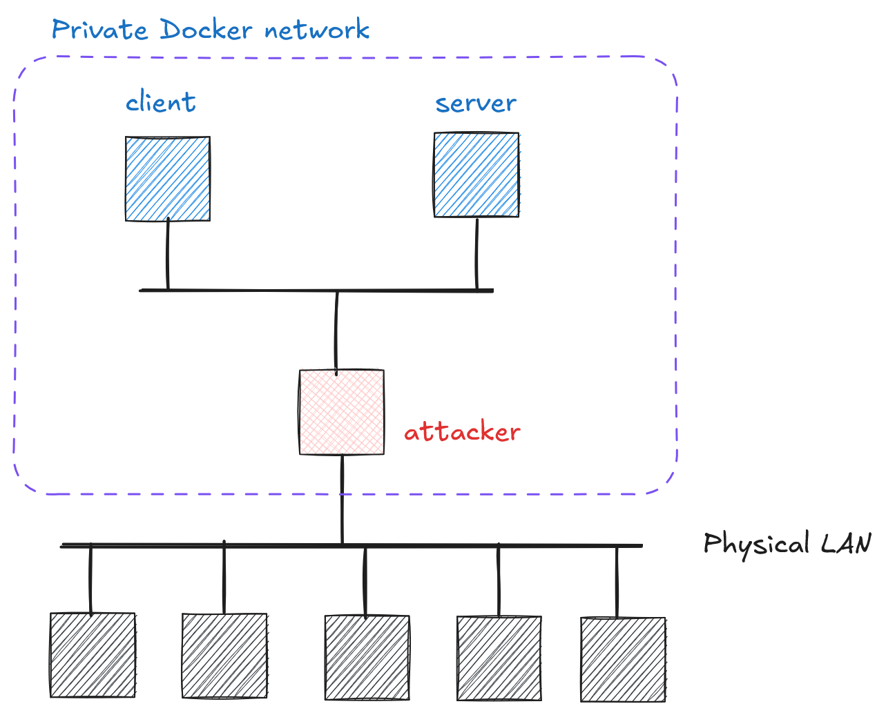

# Cryptography and Network Security <!-- omit in toc -->

# Lab 2: Confidentiality, Integrity, and Network Threats <!-- omit in toc -->

## Introduction

In this lab, we will explore fundamental security services and threats in computer networks. Specifically, we will analyze how compromising the integrity of Address Resolution Protocol (ARP) messages enables an attacker to perform Man in the Middle (MitM) attacks on computers sharing a local area network (LAN, WLAN). By actively manipulating ARP messages — an attack on integrity — an attacker can intercept communication between network hosts, ultimately compromising the confidentiality of exchanged data.

## Network Topology

For this lab, you will work with the following network setup:

  

## Challenge Description

The server implements an authenticated REST API service. The client application regularly communicates with this service. Your goal is to capture a flag in the format `crypto{th1s_is_y0ur_f1ag}`.

### Hints

1. The pseudocode in [`code/arp/`](../code/arp/) outlines how the `client` and `server` communicate. Use it to understand what traffic to expect on the network.
2. Lecture slides on ARP poisoning provide theoretical foundation.
3. Your attacking machine comes with pre-installed tools that will help you:
   - `ifconfig` - tool for network interface configuration and inspection
   - `dsniff` - suite of tools for network auditing and penetration testing
   - `tcpdump` - command-line packet analyzer (use `-vvAls0` flags for detailed payload decoding)
       > Using Linux pipes (`|`) with `grep` tool can be particularly useful for filtering decoded `tcpdump` output.
4. Being multi-homed means your attacking machine has multiple network interfaces. Use `ifconfig` to identify the correct one for capturing/spoofing.
5. You might find [CyberChef](https://gchq.github.io/CyberChef/) quite useful.
