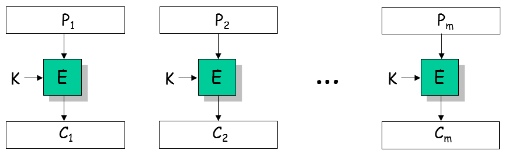
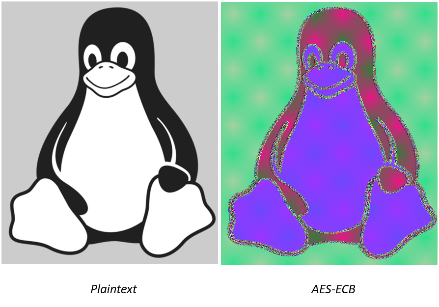
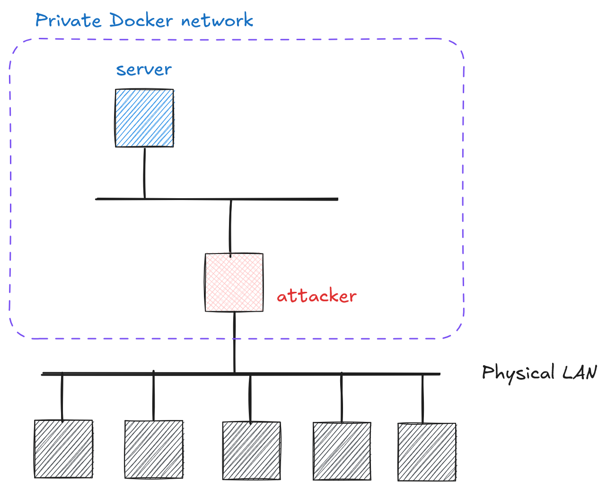

# Cryptography and Network Security <!-- omit in toc -->

# Lab 4: The fallacy of deterministic encryption <!-- omit in toc -->

## Introduction

Electronic Code Book (ECB) mode demonstrates how deterministic encryption can fail:

- Same plaintext blocks produce identical ciphertext blocks
- Patterns in plaintext remain visible in ciphertext
- No randomization between blocks

 

 

In this exercise, we will see that this encryption method does not ensure message confidentiality even when using a secure cipher (e.g., AES).

 
 

## Network Topology

The network topology for this lab is given in the image below. The server implements a simple REST API service providing ECB mode encryption:

  

## Challenge Description

Your task: exploit ECB mode's deterministic nature to recover the flag. The server encrypts data (and flag) in ECB mode, making it vulnerable to pattern analysis.

> **Chosen-Plaintext Attack (CPA)**
>
> You have access to two endpoints: one encrypts arbitrary plaintext you provide (`POST /`), the other encrypts a portion of the secret flag (`POST /challenge`). Since ECB mode is deterministic, **the same plaintext block always produces the same ciphertext block**.
>
> Leverage this property to recover the flag one character at a time by comparing ciphertexts from the two endpoints. Pay attention to padding and block alignment.

## Hints

1. Try `ssh -L 8000:server:80 your_name@your_attacker_IP` and check the REST API documentation using `http://localhost:8000/docs`
   > IMPORTANT: Understand the details of the REST API endpoints (check with the instructor if in doubt).
2. The `flag` consists of characters from the following set: `abcdefghijklmnopqrstuvwxyz0123456789{}!@#$%&*+`
3. Consult the source code [`code/ecb`](../code/ecb)
