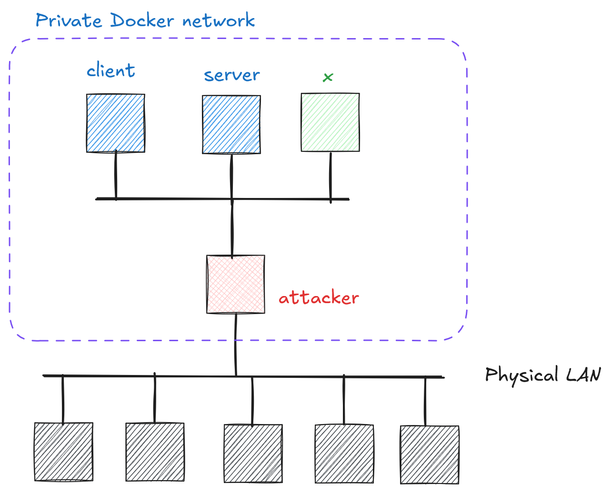

# Cryptography and Network Security <!-- omit in toc -->

# Lab 5: How Weak Secrets Defeat Strong Encryption <!-- omit in toc -->

## Introduction

Cryptographic algorithms like AES are strong in theory, but only as secure as the secrets they rely on. When session IDs or encryption keys are derived from a small random value, an attacker can brute-force them efficiently — even against AES-128.

This lab demonstrates two real-world consequences of weak entropy:

- **Session hijacking** — guessing a valid session ID to impersonate an authenticated user
- **Ciphertext decryption** — exhaustively searching a small key space to recover a flag

## Network Topology

<p align="center">
  
</p>

The server exposes a session management service with `/login` and `/protected` endpoints. The client authenticates with the server and periodically accesses `/protected`. Station `x` is also present on the network — its role will become clear as you progress.

## Challenge Description

> **Two-stage attack:**
>
> 1. **Session ID Attack:**
>    - Analyze the session ID generation pattern
>    - Guess a session ID currently used by the authenticated client
>    - Access the `/protected` endpoint and learn useful info
> 2. **Flag Decryption:**
>    - Analyze the encryption mode and key generation pattern
>    - Obtain the corresponding ciphertext
>    - Decrypt the flag

## Hints

1. Focus on `generate_session_id()` in [`code/low_entropy/server.py`](../code/low_entropy/server.py) — understand exactly what goes into producing a session ID.
2. Local port forwarding: `ssh -L 8080:server:80 your_name@your_attacker_IP`
3. Python `requests` is handy for probing the session endpoint:

   ```python
   import requests

   response = requests.get(
       "http://server/protected",
       cookies={"session_id": "YOUR_CANDIDATE_HERE"}
   )
   ```

4. The `/protected` endpoint is **rate-limited** (10 req/s per IP, 1-minute ban on excess). Pace your requests accordingly.
